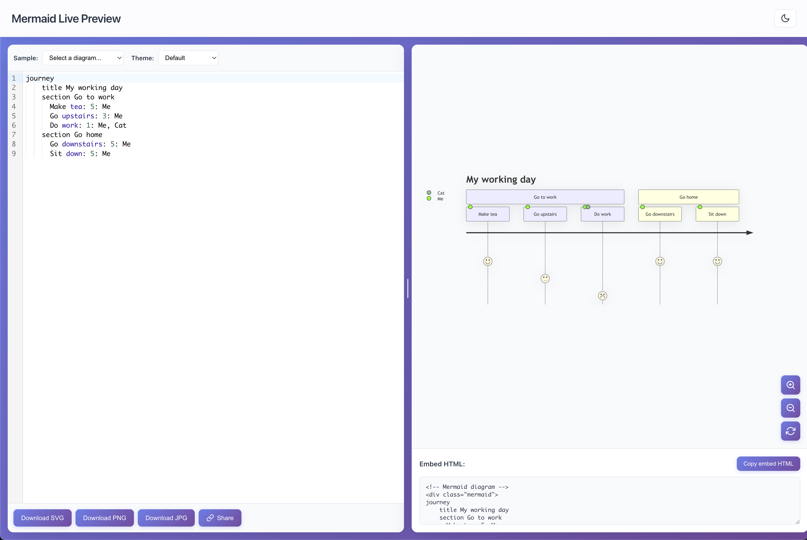

# Mermaid Live Preview
React + Vite playground for experimenting with Mermaid diagrams, themes, and shareable URLs directly in the browser.



## Setup
```bash
git clone <repo>
cd mermaid-react
yarn install
yarn dev
```
The app targets Node 18+ / Yarn 1.22+ (classic) and any modern browser. Diagram code, theme choice, divider position, and dark-mode preference persist locally so you can resume later.

## Everyday Use
- Pick a sample (flowchart, sequence, ERD, Gantt, gitgraph, mindmap, etc.) or start typing.
- Switch themes or paste custom JSON; rendering debounces for smoother edits.
- Pan, zoom, or reset the canvas; grab the embed snippet or the `#pako:` URL to share.

## Scripts
| Command | Description |
| --- | --- |
| `yarn dev` | Launch the Vite dev server with HMR. |
| `yarn build` | Produce a production bundle in `dist/`. |
| `yarn preview` | Serve the built bundle locally. |
| `yarn lint` | Run ESLint (also used in the Husky hook). |
| `yarn format` | Apply Prettier to JS/JSX/CSS files. |

## Deploying
Push to `main` and the included GitHub Action builds `yarn build` and publishes the `dist/` folder to GitHub Pages. The site is served at `https://mermaid-live-preview.wahthefox.com`, so the `public/CNAME` file is committed and DNS should point the custom domain at GitHub Pages. If you fork this repo, remove or replace the CNAME entry.

## Contributing
1. Create a branch and keep `yarn dev` running locally.
2. Let Husky’s `pre-commit` run `yarn lint`, or run it manually before pushing.
3. Include screenshots/GIFs for UI changes.

## License
MIT — see [LICENSE](LICENSE).
